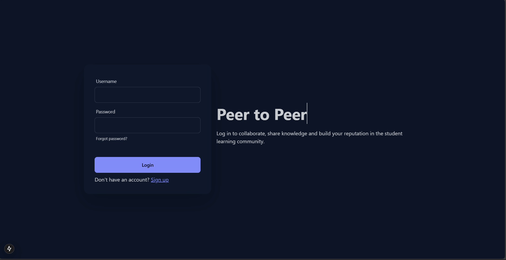
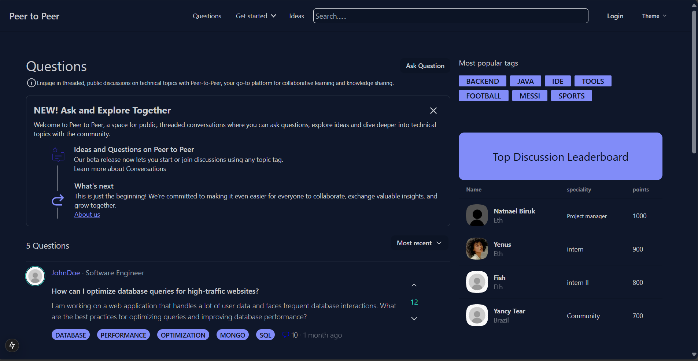
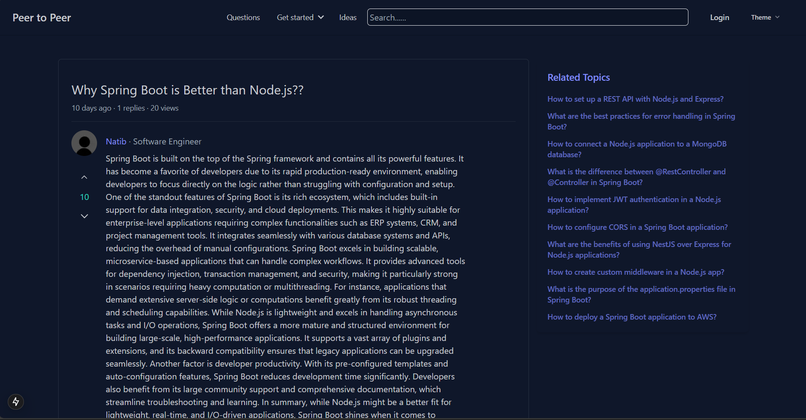

# Peer-to-Peer Learning Platform

## Overview

The **Peer-to-Peer Learning Platform** is a web-based application that allows users to ask questions, share ideas, and collaborate with peers in a learning environment. Modeled after community-driven platforms like Stack Overflow, this app enables users to accumulate reputation points based on their contributions, including asking questions, answering, and sharing ideas. The platform leverages **JWT authentication** for secure access and stores user and content data in **MongoDB**.

## Key Features

- 🔑 **User Authentication**  
  Secure user sign-up and login processes with JWT-based authentication for personalized access.
  
  


- ❓ **Question Management**  
  Users can post questions, provide answers, and engage in discussions with upvotes/downvotes to highlight valuable contributions.


  

    
- 💡 **Idea Sharing**  
  Users can post and comment on ideas, fostering brainstorming and discussions.


  


  
- 👍 **Voting System**  
  Users can upvote or downvote questions, answers, and ideas, offering feedback and helping the community find the best content.

- 🏅 **Reputation System**  
  Users earn reputation points based on their activity, such as asking questions, providing answers, and voting on content.

- 🔖 **Tagging and Searching**  
  Questions and ideas can be tagged with relevant keywords, enabling easy discovery and exploration of topics.

- 👤 **User Profiles**  
  Each user has a personal profile displaying their activity, including questions asked, ideas shared, reputation points, and contributions to the community.

## Project Structure


### Client

The **client-side** of the application is built using **Next.js**, providing an interactive, user-friendly interface. It handles user interactions, displays data, and communicates with the server via RESTful APIs. The client utilizes **Redux** for efficient state management and leverages **Server-Side Rendering (SSR)** to ensure that data is fetched on the server before the page is rendered, enhancing performance and SEO.

**Main Features:**
- **User Sign-Up and Login Forms**  
  Users can sign up, log in, and authenticate their sessions via JWT. Redux is used to manage the user state globally, ensuring consistency across components and reducing redundant API calls.

- **Interface for Posting and Answering Questions**  
  Users can create, view, and answer questions on the platform. When questions or answers are posted, they are reflected in the Redux store and UI in real-time, ensuring smooth interactions.

- **Upvote/Downvote Functionality**  
  Users can vote on questions and answers. Voting updates the state both locally via Redux and server-side via API calls, ensuring that vote counts are synced.

- **Idea Sharing and Commenting**  
  The platform allows users to share and comment on ideas. Redux helps maintain a dynamic state, enabling live updates to the idea lists and comment sections.

- **Profile Page Displaying User Activity and Reputation**  
  Each user has a profile that displays their activity, including questions asked, answers provided, and their reputation points. Data for the profile page is fetched server-side using **getServerSideProps** to 
  ensure the latest user information is available upon page load.


### Server

The **server-side** of the platform is built using **Spring Boot** with **Maven** and **JDK 23**, serving RESTful APIs for managing data and handling business logic. The server also supports **JWT authentication** to secure routes and ensure authorized access.

### Main Features:
- **User authentication using JWT tokens**  
  Secure user sign-up and login processes with JWT-based authentication for personalized access.
  
- **REST API for managing questions, answers, and ideas**  
  Exposes RESTful APIs to handle creation, retrieval, updating, and deletion of questions, answers, and ideas.

- **Database interactions for storing and retrieving user data, questions, and ideas**  
  MongoDB is used to store all user data, questions, answers, ideas, and votes.

- **Voting logic to update reputation points**  
  Users can upvote or downvote questions, answers, and ideas. Reputation points are updated accordingly based on user interactions.

- **Search functionality for questions and ideas based on tags**  
  Users can search questions and ideas using tags to easily find relevant content.

- **Filtering functionalities**  
  Allows users to filter questions and ideas by tags, most recent, most upvoted, or user-specific contributions, improving content discovery.

## Installation

### Requirements

- **Node.js** and **npm** for client-side development.
- **Java JDK 23** and **Maven** for server-side development.
- **MongoDB** for the database.

### Setting Up the Server

1. Clone the repository to your local machine:
   ```bash
   git clone https://github.com/CodeForgeLabs/Peer2PeerLearning.git
   ```

2. Navigate to the server directory:
   ```bash
   cd server
   ```

3. Install Maven dependencies:
   ```bash
   mvn install
   ```

4. Make sure you have **JDK 23** installed and configure it in your IDE or terminal environment.

5. Create a `.env` file with your MongoDB URI and JWT secret:
   ```bash
   MONGO_URI=<your-mongodb-uri>
   JWT_SECRET=<your-jwt-secret>
   ```

6. Start the Spring Boot server:
   ```bash
   mvn spring-boot:run
   ```

### Setting Up the Client

1. Make sure you have **Node.js** installed on your machine. You can download it from the official website:  
   [https://nodejs.org/](https://nodejs.org/)

2. Navigate to the client directory:
   ```bash
   cd client
   ```

3. Install client dependencies:
   ```bash
   npm install
   ```

4. Install **next-auth**:
   ```bash
   npm install next-auth
   ```

5. Start the client:
   ```bash
   npm start
   ```
   
### Usage

1. **Sign Up and Log In**  
   Users can sign up and log in to the platform, granting access to features like posting questions, answering, and voting.

2. **Post Questions and Answers**  
   Users can post new questions and provide answers. Each question/answer can be upvoted or downvoted by other users.

3. **Share and Discuss Ideas**  
   Users can share ideas and participate in discussions by commenting and voting.

4. **Search and Tag**  
   Tags can be used to categorize content, making it easier to search and discover relevant topics.

5. **View User Profiles**  
   Users can view their profiles to see activity history, including questions asked, answers provided, ideas shared, and reputation points.

## Database Schema

The application uses **MongoDB** to store the following data:

- **Users**: Contains user information such as username, email, password (hashed), and reputation points.  
- **Questions**: Stores posted questions along with answers, votes, tags, and comments.  
- **Answers**: Stores answers to questions, along with votes and comments.  
- **Ideas**: Stores ideas posted by users, along with votes, comments, and tags.  
- **Votes**: Tracks upvotes/downvotes on questions, answers, and ideas.  
- **Tags**: Categorizes content for better search and filtering.  
- **Comments**: Manages user comments on questions, answers, and ideas.  
- **Replies**: Tracks replies to ideas for detailed discussions.  

## API Endpoints

- **POST /auth/register**: User registration.
- **POST /auth/login**: User login (returns JWT token).
- **GET /api/questions**: Get all questions.
- **POST /api/questions**: Create a new question.
- **POST /api/answers**: Post an answer to a question.
- **POST /api/votes**: Vote on questions, answers, or ideas.
- **POST /api/ideas**: Share a new idea.
- **POST /api/replies**: Reply to an idea.

## Contribution

We welcome contributions to this project! To contribute:

1. Fork the repository.
2. Create a new branch.
3. Make your changes.
4. Create a pull request.


